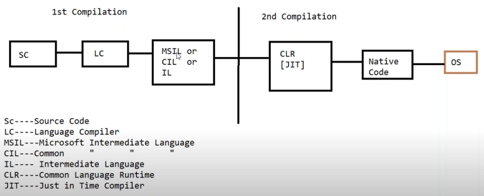
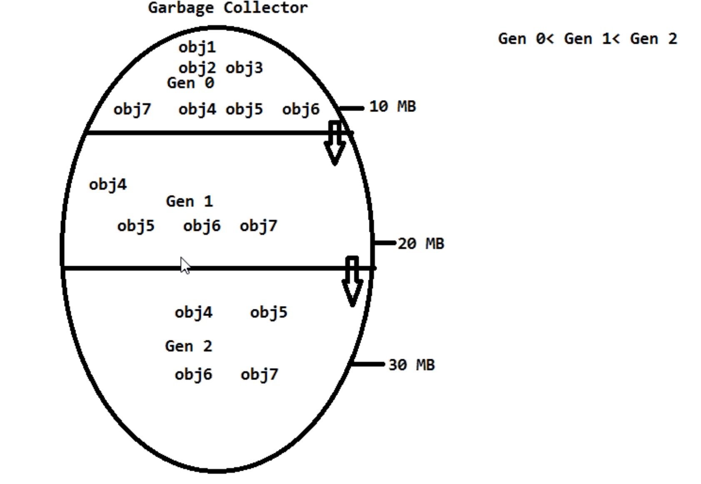

# .NET core package course

---

<details>
  <summary> Week - 1 Introduction </summary>

## Section 1

- **C# .net :** is a programming language which is used to write coding part for the application development
- **ASP.net core :** Active Server Page -- web technology or server side technology design the websites or webpages
  - Client server architecture
- **Basic UI Technologies :** HTML + CSS + JavaScript + JQuery + Bootstrap
- **SQL server :** Relational database management system
  - Storage area
- **Asp.net core MVC :** Model View Controller architecture design pattern
  - Model (database layer)
  - View (Presentation layer)
  - Controller (Server)
  - Split the code - Single Responsibility
- **Asp.net core Web API :** is a framework for building RESTful application.
- **Ado.net :** Active X data object
  - Native driver software communicates frontend (asp.net) and backend

## Section - 2

- What is .net?
  - **n**etwork **e**nabled **t**echnology - net
  - .net is a framework tool which supports around 60+ programming languages.
  - first version 2002
- What is .net framework?
  - .net framework is a collection of class libraries.
  - class libraries is a collection of predefined classes.
- .net core vs .net framework
  - After 2016, .net core was released and can be run on any OS.
  - Therefore .net core is platform independent
  - .net can be used to build different types of application
    - Standalone application (Desktop application)
      - console app
      - windows forms application (GUI) e.g. Notepad
      - windows presentation foundation (WPF)
      - windows services
    - **Distributed application or online application**
      - web applications
      - MVC applications
      - Web services
      - **web API**
      - business applications
      - network based app
      - gaming application
      - Window communication foundation (WCF)
- [Download Visual Studio](https://visualstudio.microsoft.com/downloads/)
- [Download SQL Server 2019](https://www.microsoft.com/en-au/sql-server/sql-server-downloads?SilentAuth=1&wa=wsignin1.0)
- [SSMS SQL Server - Download SQL Server Management Studio](https://docs.microsoft.com/en-us/sql/ssms/download-sql-server-management-studio-ssms?view=sql-server-ver16)
  - After downloading, add server name. It could be localhost
  - Check for Azure Data Studio, in server name, add dot .

## Section - 3

- Code execution Process

  - source code -> langauge compiler -> After successful compilation, it will be converted into byte code -> OS
  - First compilation
    - Source code will be converted into MSIL code with the help of language compiler.
    - By the end of this first compilation, the code is still in english.
  - Second compilation
    - Just In Time compiler converts Microsoft Intermediate language (MSIL) or Common Intermediate langauge into native machine code with the help of CLR (common language runtime)

  

## Section - 4

- .net components:
  - Base class libraries : write
  - CLR - common language runtime : run
- Base class libraries
  - They are building blocks of .net
  - They are similar to header files in C & C++
  - They are also called as namespaces
  - BCL or Framework class library (FCL) : They are in two forms:
    - .exe - executable file that can be run directly. It has entry point , i.e., static void Main()
    - dll - dynamic link library - supportive file , no entry point
      - This is for reusability
- Common language runtime : without this, you cannot run the code. CLR provides a runtime environment to run the program. The sub-components are :
  - CLS - common language specification : write in one programming language and execute in another programming langauge (e.g. C# -> )
  - CTS - common type system or datatype system
    - Value type -- int a = 10; compile time -- stack
    - Reference type -- int b = a; runtime ---- heap
  - GC - garbage collector
    - Provides automatic memory management , allocate and de-allocate memory
    - Can be divided into three generations:
      - generation 0 - newly created objects must be stored in gen 0 (Garbage collector rule). Idled objects are flushed out to the gen 1.
      - generation 1 - if there is no more space in the gen 0 and want to create new object, there is where collection means method comes in.
      - generation 2
      - memory space are gen 0 < gen 2 < gen 3 . Therefore, gen 3 has largest memory
      - When all gens are full, automatically, memory will be expanded.
    - It also have Optimised engine. It performs a mechanism called collection means method to find out objects are useful or not.
    - It divides objects into two categories :
      - Objects in use
      - Idled objects (Garbage) - should be destoryed. Automatic memory management
      - Destructor
    - ## 
  - JIT - Just in time compiler
    - Used to compile MSL code into native code
- C# .net
  - sharp - musical note
  - C# net = c++, VB6.0 + Java + additional features
  - functional oriented
  - object oriented
  - Case sensitive

## Section - 5

- Console app - Stand alone or desktop application 
- CUI - command user interface 
- In console app, console is a predefined class which is used to work with input and output 
  - console class present in system namespace 
  - system namespace is a library 
- Methods of console class 
  - Output methods
    - Write() - is used to display output statements within the same line.
    - WriteLine() - display output statements line by line 
  - Input methods
    - Read() - read user input - character by character - ASCII values - therefore, return type is int.
    - ReadLine() - read user input - read all characters at once. Therefore, return type is string.
- How to accept string value at runtime 
- Type casting 
  - value you accept at runtime is string data type. Therefore, you need to typecast it 
  - Convert from string to integer : two methods
    - convert.ToInt();
    - int.Parse(); => null to int convertion will raise an error - System.ArgumentNullException: 'Value cannot be null.
Parameter name: String'
  - How about float?

      ```
            Console.WriteLine(Convert.ToInt32(s));
            Console.WriteLine(Convert.ToInt64(s));
            Console.WriteLine(Convert.ToInt16(s));
      ```
    -

## Section - 6

## Section - 7


  </details>

---

<details>
  <summary> Week - 2 </summary>

## Section - 1
- Operator in C#
  - 3 + 4 = 7 
  - 3 and 4 are operands
  - + and = are operators 
- Operator types 
  - Arithmetic : +, -, /, %, * 
  - Relational : Returns boolean property and true or false < > <= >= == , !=
  - Assignment : =, +=, -=, /=, *= , 
  - Logical : and, or , not 
## Section - 2
- Array is a collection of similar data type elements
- types of arrays
  - physical size : single or 2D
  - Nature of physical size : static or dynamic (resize)
  - Memory size : Normal array (64kb), huge > 64kb
- Special type : Jagged array 
## Section - 3

- SQL
- Database is a collection of information.
- Data - raw inputs - sdfsfsdfjslkjkljwoperwueitjkalnm
- information - processed data or well-organised data 
- Tables
  - table - entity 
  - rows --- record or tuple
  - columns --- field or attribute 

    ```
        id    name    address       salary
        0     sam     123 heaven    1000
        1     sally   123 earch     400
    ```
  - Table name or column name convention e.g. employee_details , emp_address
    - cannot start with digit 
  - What is SQL server?
  - Types of Databases
    - local = MS access, Dbase, Foxpro 
    - remote = sql server, Oracle, mysql, postgres
    - internet (online) - OLAP, OLTP processing 
      - Online analytical processing
      - Online transaction processing
  - One software is required to managed these databases , it is DBMS.
    - local => DBMS
    - remote => Relational database management system
    - internet => ORDBMS
  - SQL server is a relational database management system which is used to manage and access the data from database.
  - SQL server developer 
  - SQL server database administrator 
  - Type of installation
    - Windows Authentication
    - Server Type => Database engine 
  - System Databases
    - master - admin
    - model is the template. User defined database 
    - msdb - has complete job history
      - what user does what
    - tempdb - it can temporarily store, function, trigger

- SQL commandset 
  - DDL - data definition language 
    - CREATE, ALTER, DROP
  - DML - data manipulation language 
    - INSERT, UPDATE, DELETE 
  - DCL - data control language 
    - grant, revoke => permission
  - TCL - transactional control language command 
    - ROLLBACK, COMMIT, SAVEPOINT 
  - DQL - data query language - select 


  - Services.msc

## Section - 4


</details>

---

<details>
  <summary> Week - 3 </summary>

## Section - 1

## Section - 2

## Section - 3

## Section - 4

## Section - 5

## Section - 6

</details>

---

<details>
  <summary> Week - 4 </summary>

## Section - 1

## Section - 2

## Section - 3

## Section - 4

## Section - 5

## Section - 6

</details>

---

<details>
  <summary> Week - 5 </summary>

## Section - 1

## Section - 2

## Section - 3

## Section - 4

## Section - 5

## Section - 6

</details>

---

<details>
  <summary> Week - 6 </summary>

## Section - 1

## Section - 2

## Section - 3

## Section - 4

## Section - 5

## Section - 6

</details>

---

<details>
  <summary> Week - 7 </summary>

## Section - 1

## Section - 2

## Section - 3

## Section - 4

## Section - 5

## Section - 6

</details>

---

<details>
  <summary> Week - 8 </summary>

## Section - 1

## Section - 2

## Section - 3

## Section - 4

## Section - 5

## Section - 6

</details>

---

<details>
  <summary> Week - 9 </summary>

## Section - 1

## Section - 2

## Section - 3

## Section - 4

## Section - 5

## Section - 6

</details>

---

<details>
  <summary> Week - 10 </summary>

## Section - 1

## Section - 2

## Section - 3

## Section - 4

## Section - 5

## Section - 6

</details>

---

<details>
  <summary> Week - 11 </summary>

## Section - 1

## Section - 2

## Section - 3

## Section - 4

## Section - 5

## Section - 6

</details>

---

<details>
  <summary> Week - 12 </summary>

## Section - 1

## Section - 2

## Section - 3

## Section - 4

## Section - 5

## Section - 6

</details>

---

<details>
  <summary> Week - 13 </summary>

## Section - 1

## Section - 2

## Section - 3

## Section - 4

## Section - 5

## Section - 6

</details>

---

<details>
  <summary> Week - 14 </summary>

## Section - 1

## Section - 2

## Section - 3

## Section - 4

## Section - 5

## Section - 6

</details>

---

<details>
  <summary> Week - 15 </summary>

## Section - 1

## Section - 2

## Section - 3

## Section - 4

## Section - 5

## Section - 6

</details>

---

<details>
  <summary> Week - 16 </summary>

## Section - 1

## Section - 2

## Section - 3

## Section - 4

## Section - 5

## Section - 6

</details>

---

<details>
  <summary> Week - 17 </summary>

## Section - 1

## Section - 2

## Section - 3

## Section - 4

## Section - 5

## Section - 6

</details>

---

<details>
  <summary> Week - 18 </summary>

## Section - 1

## Section - 2

## Section - 3

## Section - 4

## Section - 5

## Section - 6

</details>

---
